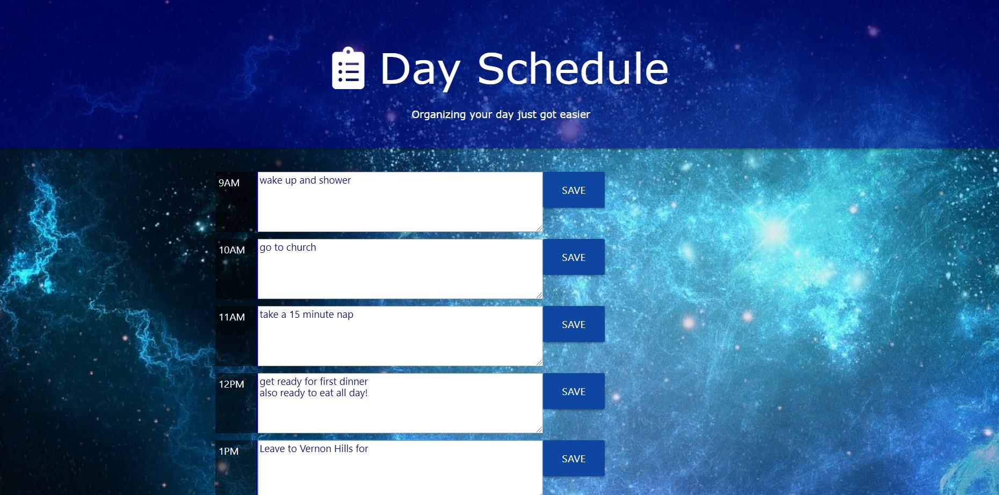

## Day Schedule

Day Schedule follows your day in a regular 8 hour time frame. The concept was that you are able to write whatever task that needs to be completed and then be able to save it. Once saved, you can refresh the page and the task will still be saved there. The main frame of the page is made of javascript with some help of styling and HTML and using Materialize as the framework. To save the information you would connect the “save” button with the localStorage.
Getting Started
Enter settings and once there activitate GitHub pages. Your website will be come live with the necessary link needed.

## Deployment
https://icek567.github.io/Schedule/
 
### Authors
Sergio Perez
